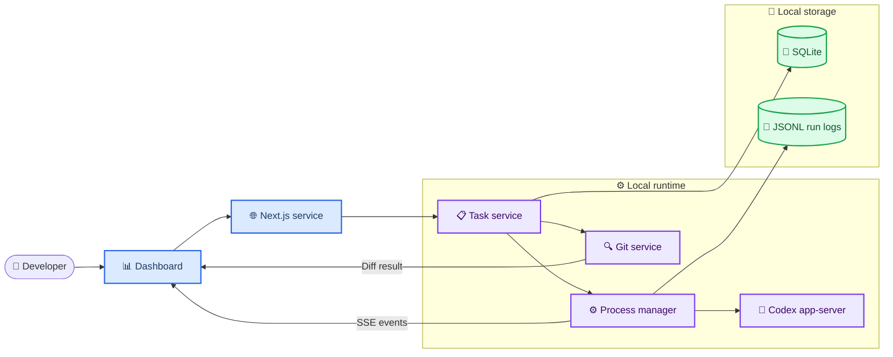
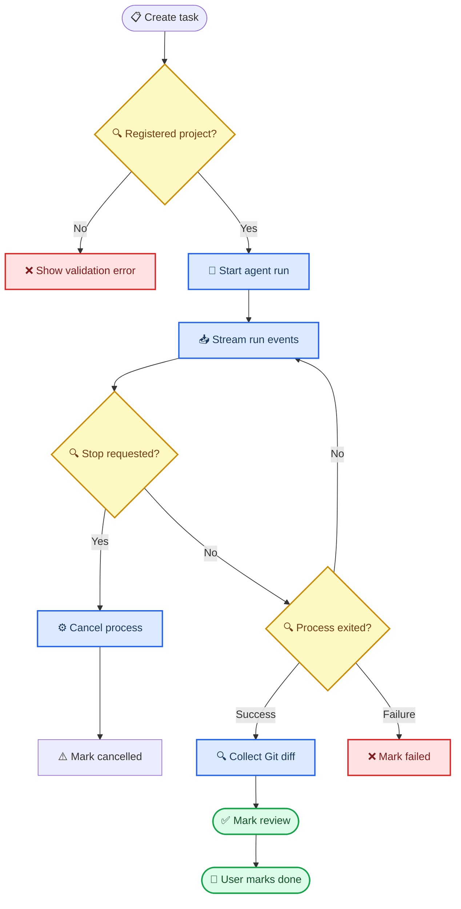

# AgentDeck Focus 产品与技术基线

_面向本地 Coding Agent 控制台的产品定义、开源参考与 MVP 技术路线 · 2026-08-09_

---

## 📋 项目摘要

**AgentDeck Focus** 是一个本地优先的 Codex 任务控制台。它不实现新的 AI Agent，而是在一个网页中让开发者创建、运行、观察、终止和复查现有 Codex 任务。

第一版的核心价值是：打开一个页面即可知道 **哪些任务在运行、Codex 正在做什么、修改了什么，以及任务是否成功结束**。产品应围绕任务、状态、事件和 Git Diff，而不是聊天气泡、云端账户或自动化编排。

> 📌 **MVP 定位：** 一个项目、一种 Agent（Codex）、一个清晰闭环。多 Agent、Worktree、PR 与成本统计均属于后续增强，而非第一版要求。

## 🎯 目标与成功定义

### 目标用户与问题

| 用户 | 当前问题 | AgentDeck Focus 的回答 |
| --- | --- | --- |
| 经常运行 Codex 的个人开发者 | 终端和任务上下文分散 | 用项目与任务统一组织运行记录 |
| 同时维护多个本地仓库的开发者 | 不清楚哪个任务仍在执行 | 首页显示运行状态、最近活动和失败项 |
| 需要审查 Agent 修改的人 | 必须手工切终端并运行 `git diff` | 在任务详情中直接查看变更与执行记录 |

### MVP 必须完成的演示闭环

1. 添加一个已有的本地 Git 项目。
2. 创建任务，填写标题和给 Codex 的提示词。
3. 点击运行，启动该项目目录中的 Codex 会话。
4. 页面实时显示任务状态与结构化活动，例如命令执行、文件变更和最终结果。
5. 用户可停止失败或无意义的运行，并可从原任务创建一次重试。
6. 任务结束后，用户可查看该项目的 `git diff --no-color` 和变更文件列表。
7. 任务与运行历史在应用重启后仍然可见。

### 完成标准

| 类别 | MVP 通过条件 |
| --- | --- |
| 本地运行 | `npm run dev` 后可在 `localhost:3000` 使用 |
| 任务管理 | 可创建、查看、启动、停止、重试任务 |
| Codex 运行 | 可启动一次真实 Codex 任务并记录退出结果 |
| 可观测性 | 状态和结构化事件能实时更新，无需刷新页面 |
| Git 审查 | 可显示当前项目相对工作区基线的变更 |
| 持久化 | 项目、任务、运行元数据和事件记录可恢复 |
| 安全边界 | 只允许已添加项目目录；网页不接受任意 shell 命令 |

## 🚫 明确不做的内容

下列项目会增加复杂度，却不帮助验证核心闭环，因此不进入 MVP：

- Claude Code、OpenCode、Cline 等多 Agent 支持
- Git Worktree 自动创建、自动提交、自动 PR 或任务依赖图
- 云同步、账户、多人协作、手机端和远程控制
- 自建 Agent、RAG、记忆系统、任务自动拆解或 Agent 协商
- 双向交互式终端、PTY 重连和终端尺寸同步
- Token 成本、限流识别、会话回放与监控分析

这些能力只应在 Codex 单 Agent 闭环稳定后，按实际使用频率逐项评估。

## 📚 开源参考与学习边界

以下项目用于学习产品结构、交互与实现模式；它们不是要被整体复制或直接改名发布的模板。若未来复制具体代码，必须遵守对应许可证、保留归属与 `NOTICE` 文件要求。

| 优先级 | 项目 | 许可 | 借鉴重点 | MVP 中不采用 |
| --- | --- | --- | --- | --- |
| 1 | [Conductor OSS][^1] | Apache-2.0 | workspace-first 信息结构、会话详情、终端与 Diff 的并列关系、本地项目状态 | Rust 后端、远程桥接、Worktree 自动化 |
| 2 | [cdesktop][^2] | Apache-2.0 | 多 CLI 会话抽象、侧栏/主体/审查面的布局、子进程管理思路 | 多模型、团队、定时任务、预览和 PR |
| 3 | [Codex app-server][^3] | 以官方仓库为准 | Codex 的 JSON-RPC 会话与结构化事件模型 | 从终端文本猜测全部状态 |
| 4 | [Cline Kanban][^4] | Apache-2.0 | 任务卡启动、运行概览、审查变更的主流程 | 依赖编排、自动提交、自动 PR、权限绕过 |
| 5 | [Clay][^5] | MIT | 多项目概览、本地 JSONL/Markdown 持久化、会话恢复观念 | 多人空间、持久人格、辩论、定时 Agent |
| 6 | [Agents Observe][^6] | MIT | 事件回放、筛选与后续用量观测的产品方向 | 监控插件和成本面板 |
| 补充 | [TUICommander][^7] | Apache-2.0 | 状态总览、等待用户输入与限流等运行信号 | 桌面 IDE、GitHub/CI/PR 全套集成 |
| 补充 | [TermCanvas][^8] | MIT | 项目 → Worktree → 终端层级及状态可视化 | 无限画布交互与桌面端产品形态 |

### 建议的阅读顺序

1. 先读 Codex `app-server` 的会话与事件定义，确定内部运行数据模型。
2. 再看 Conductor OSS 的 workspace/session/diff 产品边界，学习页面信息架构。
3. 查看 cdesktop 的 Adapter 与多会话 UI，提取将来扩展 Agent 的接口形状。
4. 最后研究 Cline Kanban 的任务卡交互，但不把其自动化范围带入 MVP。

> ⚠️ **许可证提醒：** Apache-2.0 与 MIT 通常允许复用，但不是“无需归属”的许可。实现时优先学习设计；若复制文件或明显代码片段，先核对仓库根目录的 `LICENSE`、`NOTICE` 与依赖许可证。

## ⚙️ 推荐技术路线

### 技术选型

| 层级 | 选择 | 原因 | MVP 约束 |
| --- | --- | --- | --- |
| Web 应用 | Next.js + TypeScript | 同一代码库完成界面、路由与本地服务 | 不拆 FastAPI 或微服务 |
| UI | Tailwind CSS + shadcn/ui | 快速做出紧凑、开发者工具风格的界面 | 不追求设计系统完整性 |
| Agent 运行 | `codex app-server` 的 JSON-RPC 子进程 | 提供命令、文件变更、消息等结构化事件 | 仅实现 `CodexAdapter` |
| 进程监管 | Node.js `child_process` | 保存 PID、转发事件、停止运行、记录退出码 | 暂不使用 PTY |
| 浏览器实时更新 | Server-Sent Events（SSE） | 终端在 MVP 中只读，服务端到浏览器单向推送更简单 | 以后需要键盘输入时再切换 WebSocket + PTY |
| 数据库 | SQLite + Prisma | 本地、单用户、易迁移 | 不引入账户或远程数据库 |
| 运行日志 | `.agentdeck/runs/<run-id>.jsonl` | 原始事件可审计，避免把持续日志全部塞进 SQLite | 记录前做敏感信息遮蔽 |
| Git 集成 | 系统 Git 的 `git diff --no-color` | 直接使用 Git 的可靠 Diff 输出 | 不手写 Git Diff 解析器 |

Codex app-server 会公开结构化的 `commandExecution` 与 `fileChange` 项，并携带诸如运行状态、退出码、耗时和文件 Diff 等字段。[^3] 因此，AgentDeck 应以这些事件作为任务状态与变更展示的主要来源；原始 stdout 仅作为补充日志，而不是唯一事实来源。

### 架构概览

浏览器只操作已经登记的项目。Next.js 服务负责校验项目路径、管理 Codex 子进程和写入持久状态；前端通过 SSE 接收只读事件流。

### 模块边界

| 模块 | 责任 | 不应承担 |
| --- | --- | --- |
| `ProjectService` | 登记与校验项目路径、读取项目元数据 | 执行任意文件系统命令 |
| `TaskService` | 创建任务、状态转换、重试关联、读写 SQLite | 了解 Codex CLI 参数细节 |
| `CodexAdapter` | 检查 `codex` 可用性、建立 app-server 会话、将提示词转为请求 | 管理数据库或 Git |
| `ProcessManager` | 子进程生命周期、PID、事件转发、退出处理、取消 | 知道页面或任务业务规则 |
| `RunEventStore` | JSONL 追加、过滤与敏感字段遮蔽 | 解释 Agent 语义 |
| `GitService` | 获取工作区状态、变更文件和 Diff | 决定任务是否成功 |
| `SSE endpoint` | 向当前页面转发某个运行的只读事件 | 接收终端键盘输入 |

### 持久化模型

| 实体 | 关键字段 | 作用 |
| --- | --- | --- |
| `Project` | `id`, `name`, `path`, `createdAt` | 用户明确授权操作的本地项目 |
| `Task` | `id`, `projectId`, `title`, `prompt`, `status`, `createdAt` | 一个用户意图与其当前业务状态 |
| `AgentRun` | `id`, `taskId`, `agent`, `pid`, `status`, `exitCode`, `startedAt`, `finishedAt` | 一次可重试、可审计的实际执行 |
| `RunEvent` | `runId`, `sequence`, `type`, `timestamp`, `payload` | 写入 JSONL 的结构化原始事件 |

任务状态限制为 `TODO`、`RUNNING`、`REVIEW`、`DONE`、`FAILED`、`CANCELLED`。`REVIEW` 表示 Codex 已结束但用户尚未查看变更；它不代表代码已合并或已被接受。

## 🔄 核心运行流程

### 运行规则

- 一次 `AgentRun` 只对应一个任务和一个项目路径。
- 同一任务在 `RUNNING` 状态不允许重复启动；重试创建新的 `AgentRun`。
- 停止操作必须终止受监管的子进程，并将结果记为 `CANCELLED`，而不是假装成功。
- 进程正常退出后先保留原始事件，再获取 Git Diff，最后决定 `REVIEW` 或 `FAILED`。
- 任何未捕获异常都必须以可读错误写入任务详情，而不是只留在服务端控制台。

## 🧭 页面与交互范围

| 路径 | 页面目的 | MVP 内容 |
| --- | --- | --- |
| `/` | 看总体运行情况 | 活跃任务、失败任务、最近任务、项目入口 |
| `/projects` | 管理受控项目 | 项目列表、添加项目、路径校验 |
| `/projects/[id]` | 在单个项目内组织工作 | 项目头部、任务列表、状态筛选、创建任务 |
| `/tasks/[id]` | 观察与审查一次任务 | 元数据、事件流、Stop/Retry、变更文件和 Diff |

界面风格应是深色、紧凑、以状态与代码为中心，参考 Linear、Vercel、Raycast 和 GitHub 的信息密度。不要把主工作区设计成聊天产品。

## 📈 分阶段路线图

### Phase 0：产品与运行验证

- 建立本文件中的产品边界和技术决策。
- 手工确认本机可使用 `codex app-server`，并记录其最小可运行交互。
- 只做一次命令行冒烟测试，不搭建界面。

### Phase 1：可浏览的本地任务台

- 初始化 Next.js、TypeScript、Tailwind CSS、shadcn/ui、Prisma 和 SQLite。
- 完成 Project、Task、AgentRun 的数据库模型及 CRUD。
- 完成 Dashboard、Project Workspace、Task Detail 的静态和真实数据界面。
- 此阶段不运行 Codex；目标是稳定的数据和页面骨架。

### Phase 2：真实 Codex 任务

- 增加 `CodexAdapter`、`ProcessManager` 与 app-server JSON-RPC 连接。
- 保存 PID、结构化事件、退出码和异常信息。
- 实现启动、停止、取消和重试。

### Phase 3：实时观察与 Diff

- 用 SSE 向任务详情推送运行事件。
- 实现只读活动/日志面板。
- 调用 Git 获取变更文件与统一 Diff，并展示在任务详情。
- 按 MVP 验收闭环完成端到端测试。

### Phase 4：只在真实需求验证后考虑

- 交互式终端：改用 `node-pty` 与 WebSocket。
- 多 Agent：新增 Claude Code、OpenCode 等 Adapter，保持 `ProcessManager` 无感知。
- Git Worktree：每个任务的隔离工作区与审查/合并流程。
- 可观测性：成本、限流、事件回放和跨项目筛选。

## 🔐 本地安全边界

- 只在用户通过 Project 页面登记的绝对路径中启动 Agent 或执行 Git 命令。
- 新建项目时验证路径存在，并显示其是否为 Git 仓库；非 Git 目录不能使用 Diff 功能。
- 不在网页中提供“任意 shell 命令”输入框；Custom CLI 不属于 MVP。
- 事件记录与页面显示应尽量遮蔽环境变量、访问令牌和疑似密钥。
- 停止、重试和 Diff 请求均根据 `taskId → projectId → registered path` 解析路径，禁止由浏览器直接传入 `cwd`。

## ✅ 下一步决策

本文件确认后，下一项工作应是 **Phase 0 的 Codex app-server 可用性冒烟验证**，而不是直接铺开所有页面或接入多个 Agent。若 app-server 在目标环境不可用，则降级为受监管的 `codex` 子进程，并把 stdout/stderr 作为暂时事件源；该降级必须记录为明确技术债。

## 🔗 参考资料

[^1]: charannyk06. (2026). "Conductor OSS." _GitHub_. https://github.com/charannyk06/conductor-oss
[^2]: cdesktop-ai. (2026). "cdesktop." _GitHub_. https://github.com/cdesktop-ai/cdesktop
[^3]: OpenAI. (2026). "Codex app-server README." _GitHub_. https://github.com/openai/codex/blob/main/codex-rs/app-server/README.md
[^4]: Cline. (2026). "kanban." _GitHub_. https://github.com/cline/kanban
[^5]: chadbyte. (2026). "Clay." _GitHub_. https://github.com/chadbyte/clay
[^6]: simple10. (2026). "Agents Observe." _GitHub_. https://github.com/simple10/agents-observe
[^7]: sstraus. (2026). "TUICommander." _GitHub_. https://github.com/sstraus/tuicommander
[^8]: blueberrycongee. (2026). "TermCanvas." _GitHub_. https://github.com/blueberrycongee/termcanvas

_Last updated: 2026-08-09 · Status: proposal, not yet implemented_
